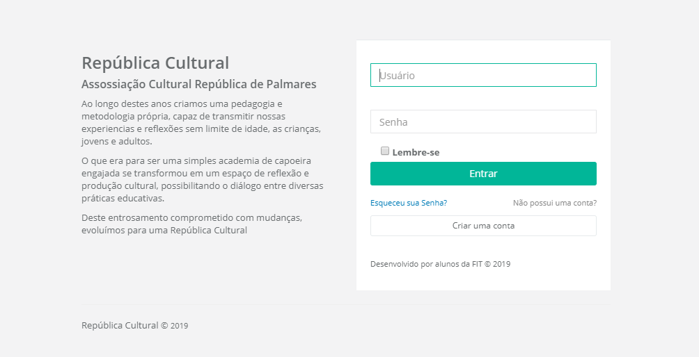
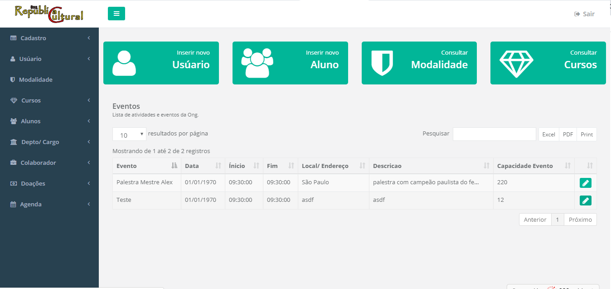

# Republica Palmares Painel Control

## Sobre
Projeto desenvolvido para cadastro e consulta de colaboradores, alunos e doadores da Republica Cultural de Palmares

## Interface

### Login

### HomeUsers

### Responsividade 

## Executando

### Pré-Requisitos
- O apache intalado
- O MySQL >= 8 instalado na maquina
- O PHP >= v 7.1.3 instalado na maquina https://php.net/
- O composer instalado na maquina https://getcomposer.org/
 
Após ter os requisitos instalados, o Laravel pode ser instalado via Composer através do comando:

	composer global required laravel/installer

## Banco de Dados

Foi utilizado o banco de dados MySQL e o mesmo é necessário para o funcionamento do projeto. Acesse a pasta RepublicaPalmaresPC e execute o comando:

	php artisan migrate

Se o comando não rodar, então crie um database chamado republicapalmares
ou então mude as configurações do banco ficam no arquivo .env

Com o laravel instalado, acesse a pasta RepublicaPalmaresPC e insira o comando:

	php artisan serve (ou php -S localhost:8000 -t public)
    

Accesse `http://localhost:8000/`
